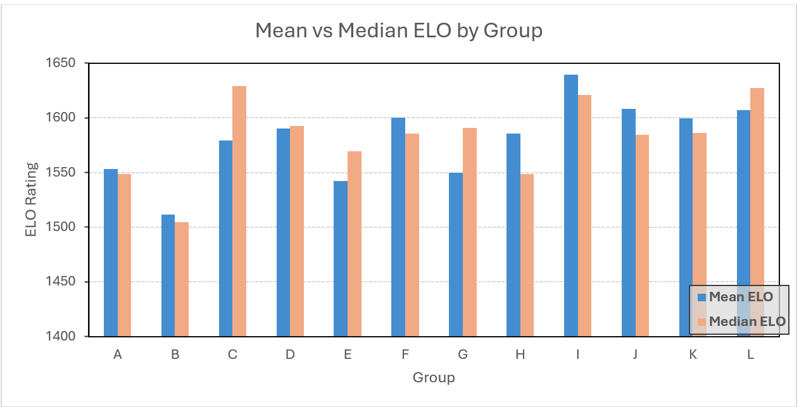

# World-Cup-2026-Group-Stage-Prediction
This is a data analysis project aims to explore whether a team strength based on FIFA official ELO can predict football match outcomes.

With the 2026 World Cup just around the corner, I thought a fun way to celebrate would be to tackle a real-world data project and learn some new skills along the way. This project uses descriptive statistics to break down how each country performed in the group stage, calculates win probabilities using the Elo rating system, and evaluates expected goals (xG) for every group stage match. This is a personal learning project where I used Claude to help brainstorm ideas and clean up the data. I hope you enjoy it!


# 1. Get data

There is a free dataset of all of the international football matches starting way back from the very first official match to the present (1872 - 2026) and still updates till present. But for this report, only data from the 2014 to 2022 World Cup tournament will be used.

Dataset link: https://www.kaggle.com/datasets/martj42/international-football-results-from-1872-to-2017

To capture the Elo rating data, official website from FIFA is the place I visit. Using some simple python function, I can scrape through website api and got the datasets of each team Elo (update till June 10, 2026).

Dataset link: https://inside.fifa.com/fifa-world-ranking/men

# 2. Analysis

To get every group of 48 teams in the group stage. I prompted a line in Claude that process the Elo team file to generate table contains match group of 48 nations that qualified for the World Cup 2026. 

Here is the prompt:

```text
Clean the data table which pick only the nation that is qualified in the world cup 2026 and add a ELO raing column next to it
```

Here is the file returned by Claude:

...

```text
Question: Which group in the WC2026 is the hardest/easiest to compete in?
```

I calculate the mean and median ELO of each group using the "average" and "median" fomular in Excel.

| Group | Average ELO | Median ELO |
|---|---|---|
| A | 1553.31 | 1548.68 |
| B | 1511.77 | 1504.90 |
| C | 1579.35 | 1629.22 |
| D | 1590.41 | 1592.54 |
| E | 1542.48 | 1569.70 |
| F | 1600.34 | 1585.68 |
| G | 1549.94 | 1590.98 |
| H | 1585.69 | 1548.48 |
| I | 1639.62 | 1620.76 |
| J | 1608.36 | 1584.22 |
| K | 1599.42 | 1586.39 |
| L | 1606.99 | 1627.02 |

Chart




